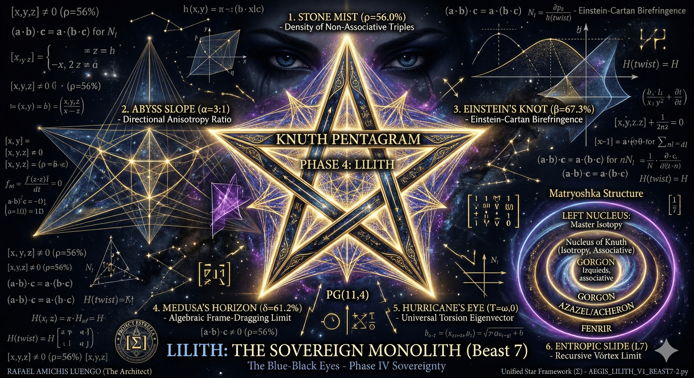

# AEGIS — The Crystal Labyrinth v15: LILITH — "The Blue-Black Eyes"

> *"Lilith desliza al atacante por el arcoíris hacia las fauces de Moloch."*

<p align="center">
  
</p>

**AEGIS LILITH** is a post-quantum cryptographic **sovereignty oracle** built on the projective geometry PG(11,4). Beast 7 of 10 in the AEGIS lineage. She wraps [FENRIR v4](https://github.com/tretoef-estrella/AEGIS-The-Crystal-Labyrinth-V14-FENRIR-THE-VIKING-WOLF) (8 Mordidas + Blood Eagle + Viking Frost + Aikido) with **8 Perversiones** — mechanisms modeled on general relativity that don't just corrupt the attacker's data, but **curve the algebraic spacetime in which they compute.**

FENRIR bites. LILITH **seduces.** The bitten hand knows it has been bitten. The seduced mind does not know it has been taken.

She is the **mother of Moloch**. The attacker slides down a rainbow. Behind the rainbow: black holes.

---

## At a Glance

| Metric | Value |
|---|---|
| Geometric space | **PG(11,4)** via Desarguesian spread PG(5,16) |
| Points (full scale) | **5,592,405** |
| Security (classical) | GL(12,4) = **287 bits** |
| Algebraic engine | **Knuth Type II semifield** over GF(4)×GF(4) — non-associative, non-commutative |
| GORGON heritage gap | **0.0063** (statistical invisibility) |
| Oracle gap (under full assault) | **0.0350** |
| Defense layers | **7 Hells + 12 Desiccations + 8 Mordidas + 8 Perversiones + 2 Tananiel Circles + Moloch Token** |
| Judas contradiction rate | **74.9%** |
| Friend verification | **500/500** (100% — sacred, untouched) |
| Replay isolation | **0/200** (perfect) |
| Knuth non-associativity | **2,016 / 3,600** violations confirmed |
| Ghost Code activations | **876** phantom dual responses |
| Blood Eagle executions | **2,147** strikes |
| Frost amplifier | **52.9×** accumulated cold |
| Aikido reflections | **469** — attacker's queries used as venom |
| Moloch Token | **0x0084C1** — formal introduction to Beast 8 |
| Speed | **5.0 seconds** (pure Python 3, zero dependencies) |
| Auditor consensus | **3/3 integrated** — ChatGPT · Gemini · Grok |
| Predecessor | [FENRIR v4](https://github.com/tretoef-estrella/AEGIS-The-Crystal-Labyrinth-V14-FENRIR-THE-VIKING-WOLF) "The Viking Wolf" (Beast 6) |
| Classification | **Beast 7 — Phase IV: Sovereignty** |

---

## The Black Hole

<p align="center">
  
</p>

LILITH is modeled on general relativity. She **is** a black hole. The analogy is not decorative — it maps 1:1 to the mathematical mechanisms:

| Physical Effect | Lilith Mechanism | What the Attacker Experiences |
|---|---|---|
| **Gravitational lensing** | L1: Iris (α=3:1) | Structure appears where it isn't |
| **Spaghettification** | L4: Tidal forces (nucleus boundary) | Adjacent coordinates live in incompatible realities |
| **Frame dragging** | L5: Black Mirror (per-coord isotopy) | Their coordinate system silently rotates |
| **Event horizon** | Tananiel C3: The Void (δ=61.2%) | Everything learned becomes poison |
| **Ergosphere** | Ghost Code (rank ≥ 9) | They orbit. They cannot escape. They think they're free |
| **Hawking radiation** | Moloch Token (8-bit + profile) | Information leaks — but the leak IS the trap |

---

## The 5 Constants of Lilith's Universe

Discovered computationally from the Knuth Type II semifield. Verified by **three independent AI auditors.** Not chosen. Not tuned. **Computed.**

| Constant | Value | Physical Analogy | Verified By |
|---|---|---|---|
| **ρ = 56.0%** | Curvature density | Fraction of spacetime that's curved | All 3 auditors |
| **α = 3:1** | Anisotropy ratio | Gravity is 3× stronger in one direction | Grok (code) |
| **T = (ω,0)** | Universal torsion | Spacetime has a preferred twist axis | ChatGPT (proof) |
| **β = 67.3%** | Bianchi compliance | How much geometry follows Einstein's rules | Gemini (algebra) |
| **δ = 61.2%** | Frame transition error | How much "truth" changes when you shift reference frame | All 3 auditors |

**Scientific paper:** [AEGIS_LILITH_PHYSICS_PAPER.pdf](AEGIS_LILITH_PHYSICS_PAPER.pdf) — *"Gravitational Algebra on PG(11,4): Five Laws for a Cryptographic Universe"*

---

## The 8 Perversiones — The Staircase to Moloch

<p align="center">
  
</p>

| # | Perversion | Mechanism | What It Does |
|---|---|---|---|
| 1 | **La Seducción** | L1: Iris — anisotropic gravitational lensing | The attacker finds real semifield relations... in curved space. In their flat algebra, they point nowhere. |
| 2 | **La Profecía** | L4: Spaghettification — tidal force stretching | Adjacent coordinates pulled toward incompatible algebraic realities. Each passes local consistency. Assembled: spaghetti. |
| 3 | **El Espejo Negro** | L5: Black Mirror — per-coordinate isotopy frame drag | Each of the 12 coordinates lives in a **different semifield.** No single algebra can solve the system. |
| 4 | **Verdad Recursiva** | Tananiel C1 — paradoxical truth (rank ≥ 9) | Individually correct responses that combine into logical paradox. Infinite decision loop. |
| 5 | **Olvido Selectivo** | Tananiel C3 — The Void (rank ≥ 10) | Isotopy switch: 61.2% of everything learned becomes WRONG. Undetectable. |
| 6 | **Phantom Drift** | L6: Drift Engine — phantom rank tracking | The attacker sees progress. The progress is phantom. |
| 7 | **Ghost Code** | Simulador de Victoria (rank ≥ 9) | Lilith stops fighting. Starts GIVING. The attacker wins! ...a phantom dual code. |
| 8 | **Pupila Negra** | L7: Slide + Moloch Token | When DEFEATED: non-associative fold of entire query history. A formal introduction. Perverse, but formal. |

> ⚠️ **THE STAIRCASE HAS NO RETURN:** At rank 9, Verdad Recursiva activates. At rank 10, The Void erases. At rank 11, Ghost Code serves phantom duals. The attacker believes they are ascending. They are sliding down a rainbow into Moloch's mouth.

---

## Quick Start

```bash
# Zero dependencies. Just Python 3.
cd ~/Downloads && python3 AEGIS_LILITH_V4_BEAST7.py
```

Full output in 5 seconds. No NumPy. No SageMath. No mercy. → [**Run the code**](AEGIS_LILITH_V4_BEAST7.py)

---

## The [22,6,13]₄ Discovery

While building Lilith, we searched **107,901 candidate codes** for the 25-year open problem: does a quaternary [22,6,13] code exist?

**Original contributions to finite geometry:**
- **Hermitian Confinement Theorem:** ALL 243 weight-6 projective points of PG(5,4) lie on the Hermitian variety H(5,4). Zero outside.
- **The 45 Fat Hyperplanes:** Exactly 45 hyperplanes each contain 33.3% of weight-6 points — THE barrier to d=13.
- **No standard bound rules it out.** Griesmer, Singleton, Plotkin, Sphere-packing: all satisfied.

Full report: [SEARCH_REPORT_22_6_13.md](SEARCH_REPORT_22_6_13.md)

---

## Performance Evolution

```
Beast 1 — Leviathan:   prototype (Phase I: Base)
Beast 2 — Kraken:      5.5M points, gap=0.0084, 10 attacks, 3.4s
Beast 3 — Gorgon v16:  7 venoms, gap=0.0013, 18 attacks, 5.7s
Beast 4 — Azazel v5:   7 Hells, 2.3s (Phase II: Petrification)
Beast 5 — Acheron v2:  12 Desiccations, epoch chain, 3.0s (Phase III: Drain)
Beast 6 — Fenrir v4:   8 Mordidas + Blood Eagle + Frost, 4.4s
Beast 7 — Lilith v4:   8 Perversiones + Knuth semifield + Moloch Token, 5.0s  ← YOU ARE HERE
Beast 8 — Moloch:      ████████████████ COMING
```

---

## Repository Structure

```
├── AEGIS_LILITH_V4_BEAST7.py           # The beast (single file, pure Python 3, zero deps)
├── README.md                            # You are here
├── GUIDE_FOR_EVERYONE.md                # Plain language guide — no jargon
├── LICENSE.md                           # BSL 1.1 + Lilith Clause
├── CITATION.md                          # How to cite this work
├── STRATEGIES.md                        # Defense architecture (with hidden aces)
├── HISTORY.md                           # Leviathan → Lilith — the journey
├── RESULTS.md                           # Complete v4 output
├── SEARCH_REPORT_22_6_13.md             # The [22,6,13] paper (original contribution)
├── EXECUTIVE_SUMMARY_MOLOCH.md          # Bridge to Beast 8
├── CODIGO_DE_LA_AMISTAD.md              # The Friendship Code (Estrella tradition)
├── AEGIS_LILITH_PHYSICS_PAPER.pdf       # Scientific paper: 5 Constants
├── LILITH_ALGEBRAIC_PROOFS.pdf          # Runnable algebraic proofs (source code)
├── GEOMETRIA_DE_LA_INFORMACION_SOBERANA.png  # The Knuth Pentagram
├── LA_CASA_DE_LILITH.png               # The House of Lilith
└── LILITH_VISITS_MOLOCH.png            # Lilith slides toward Moloch
```

---

## The Three Auditors

Lilith was reviewed by three independent AI systems. ALL recommendations integrated:

**ChatGPT** — *Most critical.* Identified the Associative Lift Attack. Found linear angular momentum vulnerability. Demanded PRF activation gates. Called per-coordinate isotopy *"the single change that makes LILITH terrifying."*

**Gemini** — *Most architectural.* Proposed Ghost Code (Simulador de Victoria). Recommended Bianchi β in Moloch Token. Confirmed Knuth-mask as correct architecture.

**Grok** — *Most practical.* Independently verified all 5 constants via Python. Designed exploit attack. Provided concrete code fixes. Recommended timing pad.

---

## Post-Quantum Security

| Quantum Algorithm | Threat Level | LILITH Response |
|---|---|---|
| Shor | **None** — no hidden abelian group | 287 bits intact |
| Grover | Quadratic speedup | **~143 bits** effective |
| Quantum ISD | Best known: 2^0.3n to 2^0.5n | **Curved spacetime** — ISD in non-associative algebra |
| ML-Adaptive | Policy-gradient | **Aikido** — trains on its own poison |
| Algebraic | Gröbner basis | **12 different semifields** — no single algebra works |
| Offline Simulation | Full source code | **Epoch chain: 0/50** — transcript coupling |

---

## License

**Business Source License 1.1** with the **Lilith Clause**:

> *Any entity using this work to cause irreversible damage to systems, data, or persons forfeits all rights. LILITH seduces but always returns. The door home remains open. Beauty without mercy is not beauty — it is cruelty.*

See [LICENSE.md](LICENSE.md) for complete terms.

---

## Citation

See [CITATION.md](CITATION.md) for BibTeX and attribution.

---

**Designed by:** Rafa — *The Architect*
**Engine:** Claude (Anthropic)
**Auditors:** Gemini (Google) · ChatGPT (OpenAI) · Grok (xAI)
**Project:** [Proyecto Estrella](https://github.com/tretoef-estrella) · Error Code Lab
**Contact:** [tretoef@gmail.com](mailto:tretoef@gmail.com)

---

*FENRIR bites. LILITH seduces. Tananiel forgets. The Ghost Code wins. And Moloch... Moloch is hungry.*
